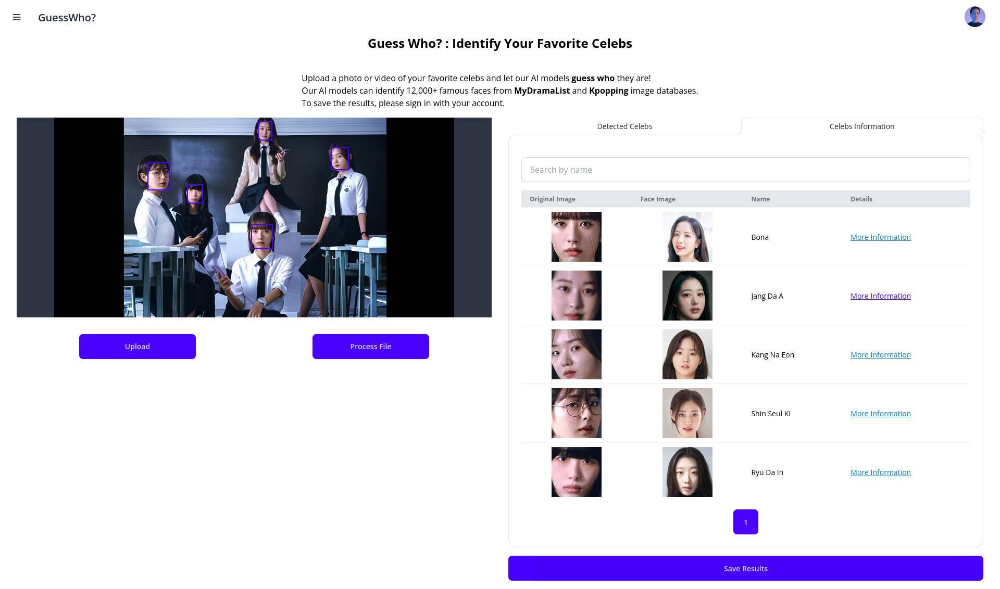
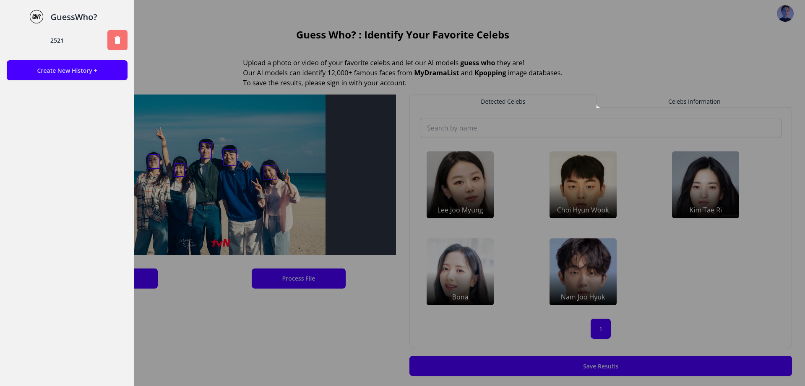
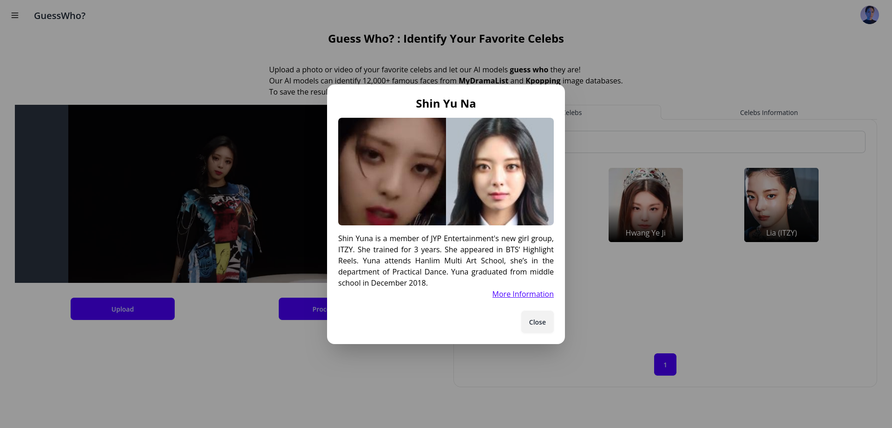

# GuessWho?

GuessWho? is an application that identifies the faces of Korean idols and actors from an image or a video using a face recognition model connected vector databases containing 12,000+ faces from Kpopping and MyDramaList image database.

## Tech Stack

<div syle="display: flex; justify-content: space-around;">
&nbsp;


</div>

## Screenshot

<div style="display: flex; justify-content: space-around;">






</div>

## Setup Instructions

### Prerequisites

- Docker
- Docker Compose

### Cloning the Repository

```bash
git clone https://github.com/yourusername/guesswho.git
cd guesswho
```

### Running the Application


1. Download the database from [This Link](https://drive.google.com/file/d/1C7zcIxtDTF48N-5D_u2oTxllwEZ_LU31/view?usp=sharing) and put it to `./vector-database` directory

2. Navigate to the project directory:

    ```bash
    cd guesswho
    ```
2. Create `.env` in 'svelte-frontend' folder and 'fastapi-backend'. By default, you can just copy `.env.example` file to `.env

    ```bash
    cp svelte-frontend/.env.example svelte-frontend/.env
    cp fastapi-backend/.env.example fastapi-backend/.env
    ```

3. Build and start the containers:

    ```bash
    docker-compose up --build
    ```
    or if you use GPU, run:
    ```bash
    docker-compose -f docker-compose-gpu.yml up --build
    ```

4. Access the application:
    - Frontend: `http://localhost`
    - Backend: `http://localhost:8000`